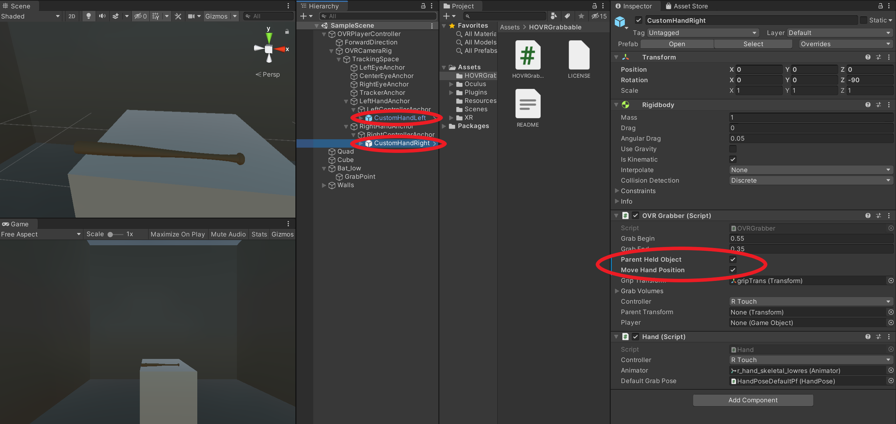
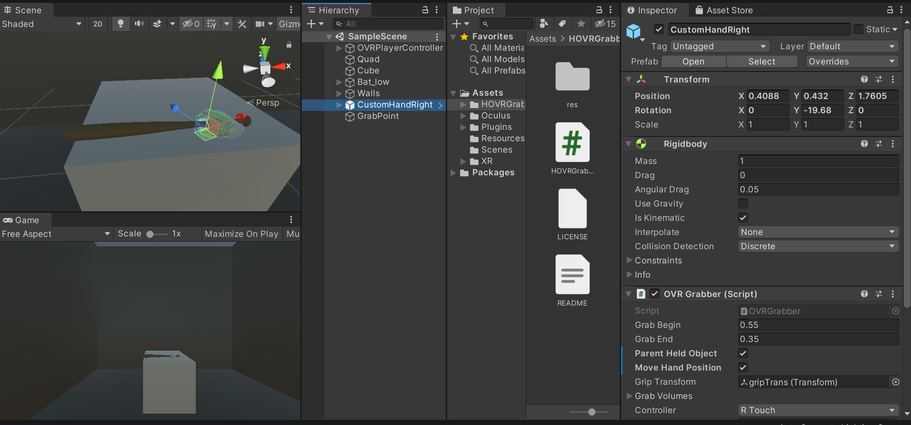
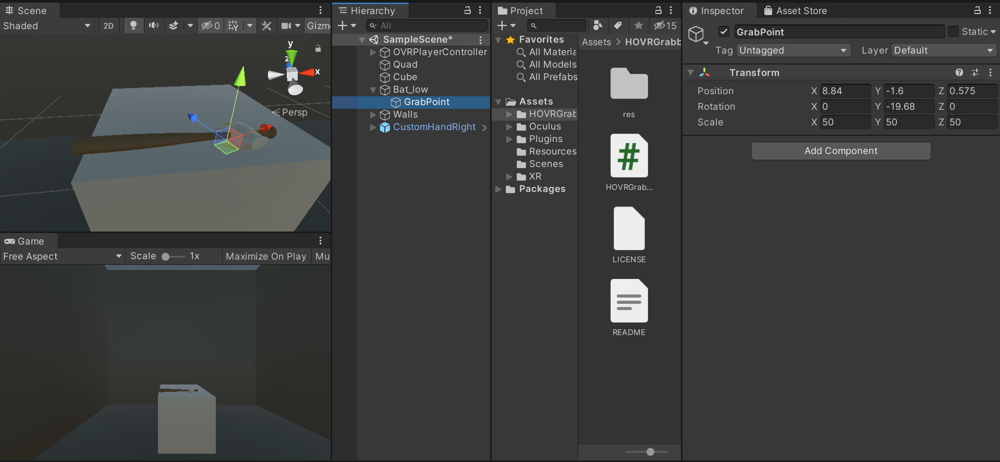
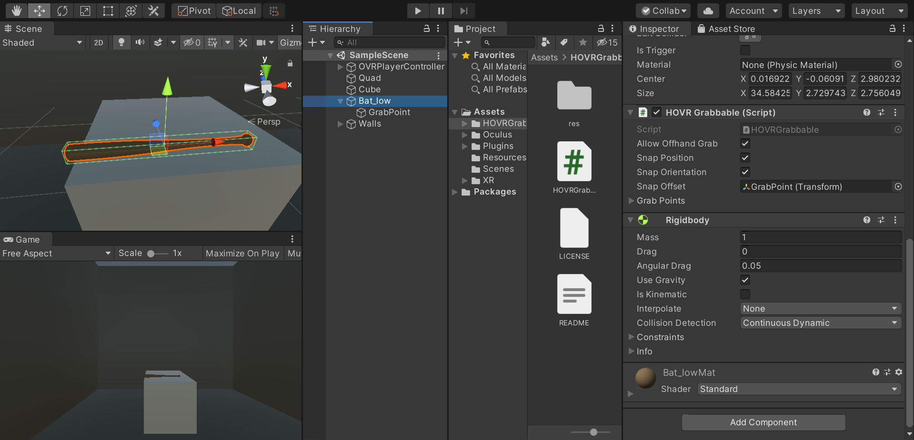

# HOVRGrabbable
This repository contains a wrapper around the OVRGrabbable script of Oculus to make snap offset mechanics more intuitive towards developers.

## How it works
To ensure the grab will work correctly, enable the properties "Parent Held Object" and "Move Hand Position" on all OVRGrabbers (typically your right and left hand).
 

Then to create a new snap spot for objects do the following:
- Create a new empty GameObject (this will be the *Snap Transform*), we will call it "GrabPoint" in the screenshots.
- Copy the right hand asset in the scene (in our case *CustomHandRight* from Oculus OVR package).
- Move and rotate the hand object to the orientation and location where you want it to grab the object.

- Copy the values of the hand transform to the new GameObject ("GrabPoint").
- Drag the new GameObject ("GrabPoint") so it becomes the child of the object you want to grab (in our case the object "Bat_low").

- Remove the copied hand asset from the scene ("CustomHandRight").
- Finally, set the *Snap Transform* of *HOVRGrabbable* in the object to grab ("Bat_low") to the new child object ("GrabPoint"), 

If you want the object to be grabbed to snap to the specific position, enable *Snap Position*. If you want the rotation to snap to the hand, enable *Snap Orientation*.

Example scenario:

https://user-images.githubusercontent.com/11212335/149667374-db07b94e-dc68-4131-afba-5cb5b8122e3f.mp4

## Why we do this
The original [OVRGrabbable](https://developer.oculus.com/reference/unity/1.43/class_o_v_r_grabbable/) script requires developers to make the *Snap Transform* a child object of the VR hands. This creates a lot of clutter when there are a lot of objects that use these features and is less flexible during scene changes. It also requires more work to calculate the offset required to hold the objects properly.
